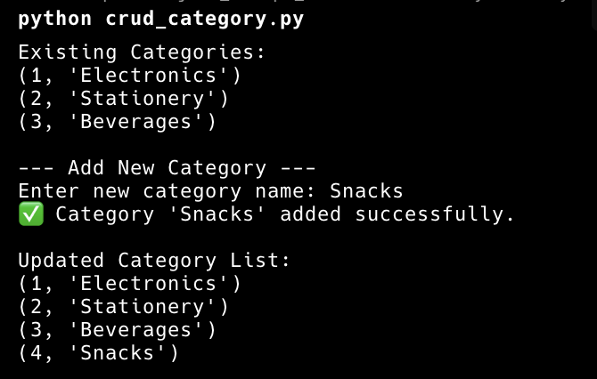
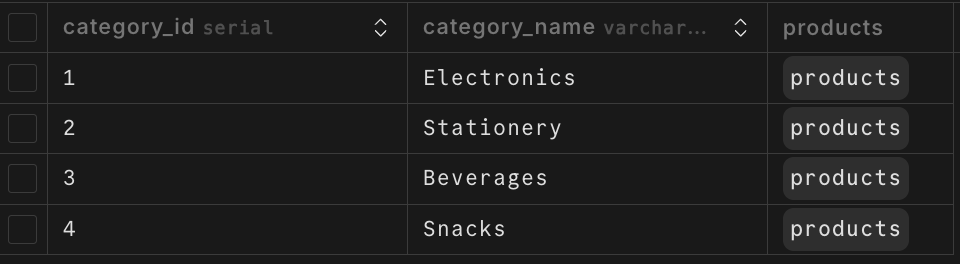

## Keita

#### Tasks:

- [x] Implement `create_category(name)`
- [x] Implement `get_all_categories()`

#### SQL Query

```sql
# get_all_categories()
SELECT category_id, category_name FROM category ORDER BY category_id ASC;

# create_category(name)
INSERT INTO category (category_name) VALUES (...);
```

#### Result:

- **Terminal:**

  

- **Database (Neon):**

  

---
