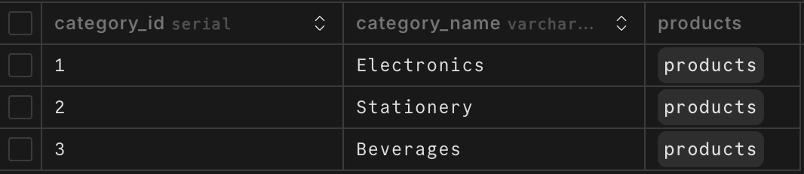
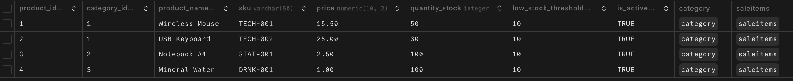
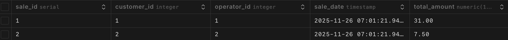
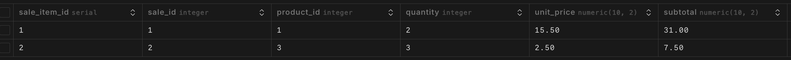

# Week 4: Web Application Integration

**Objective:** Convert our CLI tool into a fully functional Web Application using Flask.

## 🚀 Setup Instructions

1.  **Navigate to the Week 4 Folder**
    Open your terminal in the project root and enter:

    ```bash
    cd week4_integration
    ```

2.  **Install Dependencies**
    We need new libraries for the web server (`Flask`). Run:

    ```bash
    pip install Flask flask-login psycopg2-binary bcrypt python-dotenv
    ```

3.  **Database Configuration (Copy from Week 3)**

    Copy the `.env` file from the `week3_CRUD_demo` folder and paste it into the `week4_integration` folder.

4.  **Run the Web Server**
    Start the application:

    ```bash
    python app.py
    ```

5.  **Access the Website**
    Open your browser and go to:
    👉 **http://127.0.0.1:5000**

---

## 👥 Team Assignments & Git Workflow

### Keita

**Focus:** Infrastructure, Auth & Sales Module

- **Files:** `app.py`, `auth.py`, `crud_sale.py`, `templates/base.html`, `templates/index.html`, `templates/login.html`, `templates/sales_*.html`
- **Tasks:**
  - **Infra:** Setup Flask App factory, Folder structure, and `base.html` (Navbar/Layout).
  - **Auth:** Implement `auth.py` logic and `/login`, `/logout` routes.
  - **Sales:** Implement `crud_sale.py` (Transaction logic) and Sales UI (`/sales`, `/sales/new`).

### Filbert

**Focus:** Product Management Module

- **Files:** `crud_product.py` (Backend), `templates/products.html`, `templates/add_product.html` (Frontend)
- **Tasks:**
  - **Backend:** Finalize `crud_product.py` (Update/Delete logic).
  - **Routes:** Implement `@app.route('/products')`, `/product/add`, and `/product/delete/<id>`.
  - **Frontend:** Create **Product List** (Table) and **Add Product** (Form).

### Arya

**Focus:** Customer Management Module

- **Files:** `crud_customer.py` (Backend), `templates/customers.html`, `templates/add_customer.html` (Frontend)
- **Tasks:**
  - **Backend:** Finalize `crud_customer.py`.
  - **Routes:** Implement `@app.route('/customers')` and `/customer/add`.
  - **Frontend:** Create **Customer List** (Table) and **Add Customer** (Form).

---

## 🎨 Frontend Guidelines (Tailwind CSS or Pure CSS)

The project is set up with **Tailwind CSS** by default, but you are free to use standard CSS (`style.css`) if you prefer.

**Option 1: Tailwind CSS**

- Use utility classes directly in your HTML.
- Example: `<button class="bg-blue-500 text-white p-2 rounded">`
- No extra CSS file needed.

**Option 2: Pure CSS**

- If you prefer standard CSS, write your styles in: `static/style.css`.
- Use standard classes: `<button class="my-btn">` and style `.my-btn` in the CSS file.

**⚠️ Template Rule**
All HTML files must extend the base layout. Start your file like this:

```html
 
<!-- Your HTML code goes here -->

```

---

## 📊 Database Schema (Reference)

**1. Category Table**

- Columns: `category_id` (PK), `category_name`

  

**2. Customer Table**

- Columns: `customer_id` (PK), `customer_name`, `phone`, `created_at`

  

**3. Product Table**

- Columns: `product_id` (PK), `category_id` (FK), `product_name`, `sku`, `price`, `quantity_stock`

  

**4. Operator Table** (For Login/Auth)

- Columns: `operator_id`, `username`, `password_hash`, `role`

  

**5. Sale Table**

- Columns: `sale_id`, `customer_id`, `operator_id`, `sale_date`

  

**6. SaleItem Table**

- Columns: `sale_item_id`, `sale_id`, `product_id`, `quantity`, `unit_price`, `subtotal`

  

---

## ⚠️ Important Notes

- **Do not edit `base.html`** unless necessary (it breaks the layout for everyone).
- **Troubleshooting:**
  - If you see `TemplateNotFound`, make sure your HTML is inside the `templates/` folder.
  - If the database isn't connecting, check if `.env` exists in the `week4_integration` folder.
